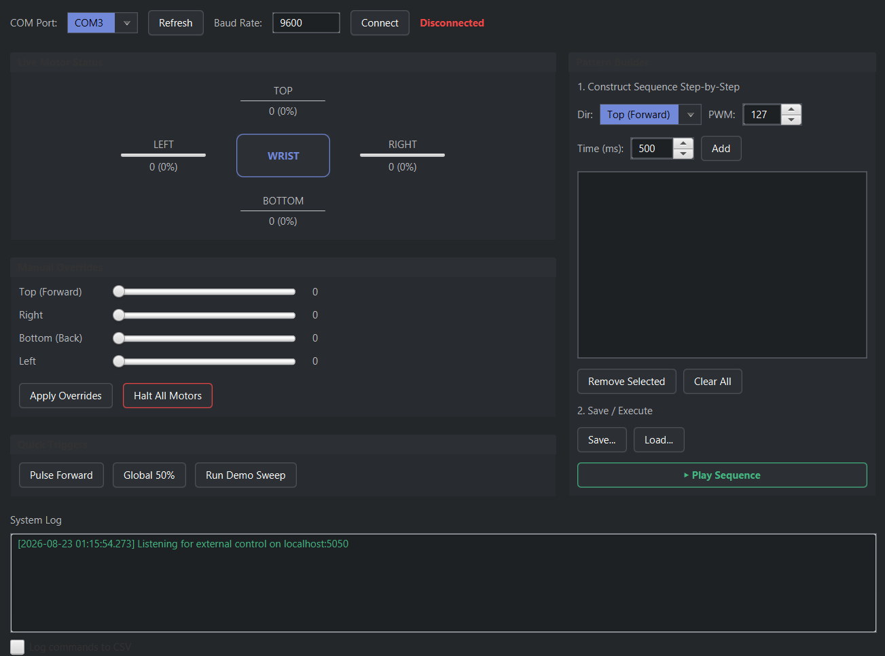

# Haptic Wristband Monitor



The **Haptic Wristband Monitor** is a JavaFX application designed to control and monitor a 4-motor haptic wristband connected via an Arduino.

Because only one process can hold a COM port open at a time, this application serves as the single owner of the serial link. It allows existing external teleoperation or Python control scripts to send commands to a local socket, while this app forwards those commands to the Arduino and updates the visual interface in real-time. It also provides a robust interface for researchers to manually design, execute, and record custom haptic patterns.

## Current Hardware Wiring Map

| Motor Position (Angle) | Module Pin | Arduino Pin | Reason |
|---|---|---|---|
| **Top (0°)** | IN | 3 | (Your current setup) |
| **Right (90°)** | IN | 5 | Next available PWM pin |
| **Bottom (180°)** | IN | 6 | Next available PWM pin |
| **Left (270°)** | IN | 9 | Next available PWM pin |
| **All Motors** | VCC | 5V | Powers the modules (ensure your power supply can handle 4 motors simultaneously) |
| **All Motors** | GND | GND | Completes the circuit |

## Features

* **Serial Port Management:** Connects to the Arduino via a designated COM port and baud rate (default 9600), handling the initialization and 2-second reset delay automatically.
* **Local Command Server:** Runs a background server on `localhost:5050`. External processes can connect and send command strings in the format `top,right,bottom,left\n`.
* **Live Motor Dashboard:** Displays a cross-layout visual representation of the wristband (Top, Left, Right, Bottom) with progress bars and percentage readouts reflecting the current PWM values (0-255).
* **Visual Pattern Builder:** A step-by-step graphical editor that allows users to design complex haptic sequences without writing code. Select a motor direction, set exact PWM intensities (0-255), and define step durations in milliseconds.
* **Save & Load Patterns:** Custom sequences built in the Pattern Builder can be saved to and loaded from `.hpt` files, making it easy for researchers to share and reproduce specific haptic experiments.
* **Manual Overrides:** Features manual sliders and "All Off" toggles to control the motors directly from the UI.
* **Test Presets:** Includes built-in preset sequences (e.g., "Pulse Top", "All 50%", and a full automated test sequence) matching the original test scripts.
* **Session Logging:** Optionally records all commands (including timestamps, values, and the command source) to a CSV file for data analysis.

## Usage Workflow & Prerequisites

Before running any external control scripts (Python scripts, Java integration modules, or teleoperation code), the **Haptic Wristband Monitor application must be launched and connected first**.

1. **Upload Firmware:** Flash your Arduino with the motor control firmware.
2. **Launch Application:** Start the JavaFX application (`MainApp.java`).
3. **Establish Serial Connection:** Select your Arduino's COM port from the UI dropdown and click **Connect**.
4. **Verify Command Server:** Ensure the background server is active (default listening on `localhost:5050`).
5. **Run External Scripts:** Execute your Python scripts or Java client programs. They will connect via TCP and send motor signals through the application interface.

> **Note:** If an external client attempts to connect before the JavaFX app is running or before the background server is bound, the connection will fail with a `ConnectionRefused` / `SocketException`.

## External Control API & Client Libraries

To control the wristband from external software, open a TCP socket connection to `localhost:5050` and send a comma-separated string of four integers followed by a newline:

`top,right,bottom,left\n`

The values correspond to PWM signals (`0-255`). For example, `255,127,0,64\n` sets Top to 100%, Right to 50%, Bottom to 0%, and Left to 25%. Malformed or missing inputs are safely ignored and logged.

### Python Client

Use `HapticClient` in `haptic_client.py`:

```python
from client.haptic_client import HapticClient

# Must be run AFTER launching the JavaFX app and connecting to the COM port
with HapticClient() as client:
    # Send raw PWM (0-255) for top, right, bottom, left
    client.send_raw(255, 0, 0, 0)

    # Helper method for directional pulses (direction, pwm, duration_sec)
    client.pulse_direction("right", 127, 1.0)
    client.stop_all()
```

### Java Client

Use HapticClient in com.example.hapticband.HapticClient:

```java
import com.example.hapticband.client.HapticClient;

// Must be run AFTER launching the JavaFX app and connecting to the COM port
try (HapticClient client = new HapticClient("localhost", 5050)) {
        client.connect();

// Pulse top motor for 1 second at full intensity
    client.pulseDirection("top", 255, 1000);

// Set all motors to 50%
    client.sendRaw(127, 127, 127, 127);
    Thread.sleep(1000);

    client.stopAll();
} catch (Exception e) {
        e.printStackTrace();
}
```

### Architecture
The project is divided into five key components:

1. MainApp.java: The JavaFX entry point that builds the UI, manages the state, binds manual controls and presets, and handles the Visual Pattern Builder execution.

2. CommandServer.java: A threaded socket server that listens on port 5050 for incoming external client connections.

3. SerialManager.java: Wraps jSerialComm to maintain exclusive access to the serial link and send clamped (0-255) motor PWM values to the Arduino.

4. MotorGauge.java: A custom JavaFX visual component representing individual motor PWM levels.

5. Client SDKs: Lightweight client helper libraries in Java (HapticClient.java) and Python (haptic_client.py) for easy third-party integration.

### Requirements

- Java JDK 17+ (with JavaFX)
- Python 3.8+ (if using Python control scripts)
- jSerialComm library 
- Arduino hardware with 4 motor drivers connected
